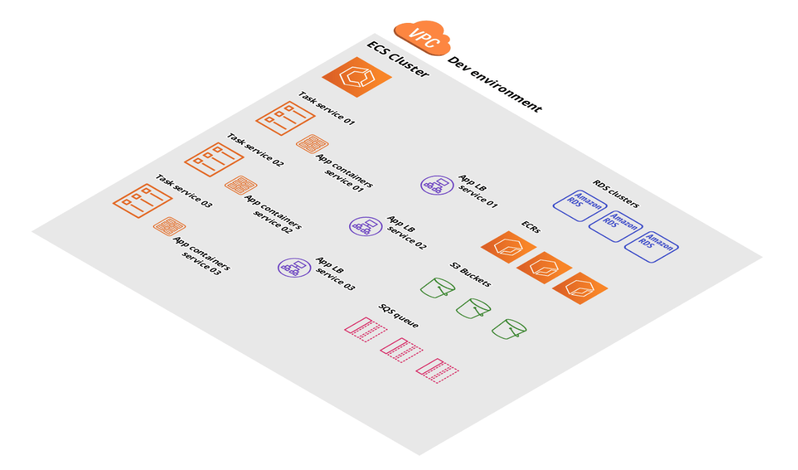

# A simple diagram about the solution:



## Prerequisites to run example Infrastructure 
* Create 1 S3 Bucket, to store all the Terraform state files *(example: example-app-tfstate)*
* Have a profile configured, with your AWS access information. You can check [here](https://docs.aws.amazon.com/cli/latest/userguide/cli-configure-profiles.html) how to do that.

## AWS example variables and parameters
At the archive *vars.tf* you can find all the variables used on this project.

## How to create example Infrastructure
1. Run the following terraform command to initialize Terraform modules 
```shell
 terraform init 
 ```
2. Run the following terraform command to plan all the infrastructure that terraform will deploy on AWS:
```shell
 terraform plan 
 ```
3. Run the following terraform command to deploy the resources to AWS.
```shell
 terrafom apply --auto-approve 
 ```
4. Test all your AWS resources have been created by Terraform.


